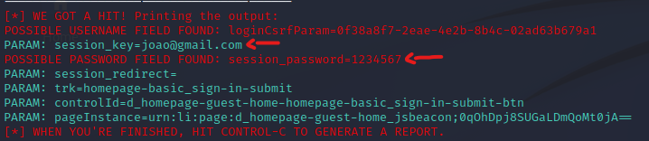

# Phishing para captura de senhas do Linkedin

## Projeto desenvolvido para fins de estudo e pesquisa de técnicas de engenharia social em ambientes controlados. O objetivo foi adquirir conhecimentos sobre as táticas utilizadas pelos criminosos cibernéticos e desenvolver maneiras de prevenção e detecção dessas ameaças. 

### Ferramentas

- Kali Linux
- setoolkit

### Configurando o Phishing no Kali Linux

- Acesso root: `sudo su`
- Iniciando o setoolkit: `setoolkit`
- Tipo de ataque: `Social-Engineering Attacks`
- Vetor de ataque: `Web Site Attack Vectors`
- Método de ataque: `Credential Harvester Attack Method `
- Método de ataque: `Site Cloner`
- Obtendo o endereço da máquina: `ifconfig`
- URL para clone: [http://www.linkedin.com]

### Resultados

